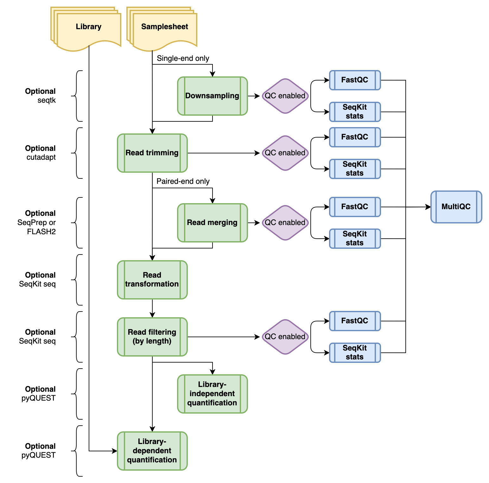

# QUANTS

## Introduction

**QUANTS** is a bioinformatics best-practice pipeline for the conversion of FASTQ, generated by saturation genome editing (SGE) screens, into counts.

The pipeline is built using [Nextflow](https://www.nextflow.io), a workflow tool to run tasks across multiple compute infrastructures in a very portable manner. It uses Docker/Singularity containers making installation trivial and results highly reproducible. The [Nextflow DSL2](https://www.nextflow.io/docs/latest/dsl2.html) implementation of this pipeline uses one container per process which makes it much easier to maintain and update software dependencies.

## Pipeline summary

## Requirements

* [`Nextflow`](https://nf-co.re/usage/installation) (`>=21.10.6`)

* [`Docker`](https://docs.docker.com/engine/installation/) or [`Singularity`](https://www.sylabs.io/guides/3.0/user-guide/).

## Documentation

The QUANTS pipeline comes with documentation about the pipeline [usage](assets/usage), [input](assets/input), [parameters](https://assets/parameters) and [output](https://assets/output).

## Credits

QUANTS was originally written by Victoria Offord using the foundation provided by [nf-core](https://nf-co.re).

## Citations

You can cite the `nf-core` publication as follows:

> **The nf-core framework for community-curated bioinformatics pipelines.**
>
> Philip Ewels, Alexander Peltzer, Sven Fillinger, Harshil Patel, Johannes Alneberg, Andreas Wilm, Maxime Ulysse Garcia, Paolo Di Tommaso & Sven Nahnsen.
>
> _Nat Biotechnol._ 2020 Feb 13. doi: [10.1038/s41587-020-0439-x](https://dx.doi.org/10.1038/s41587-020-0439-x).
